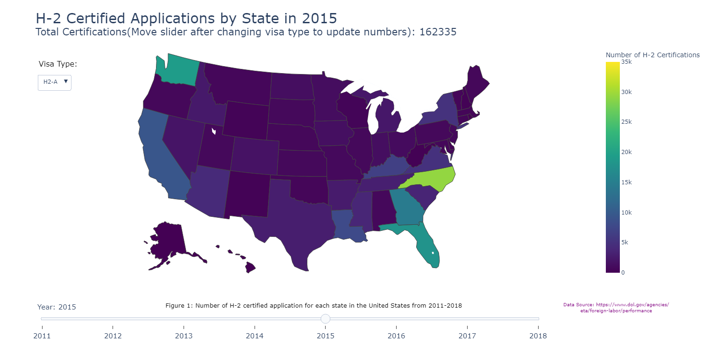
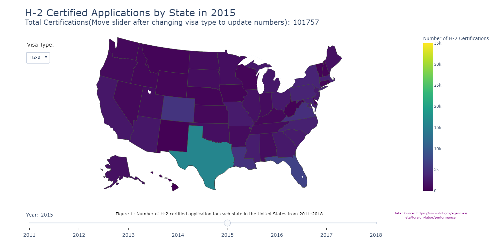
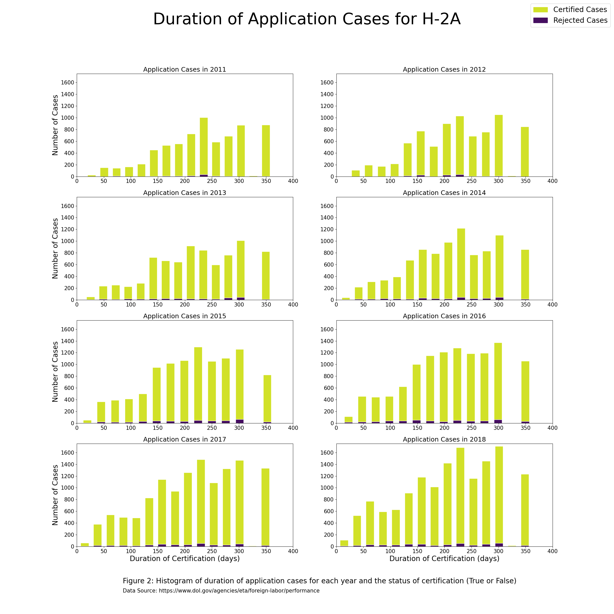
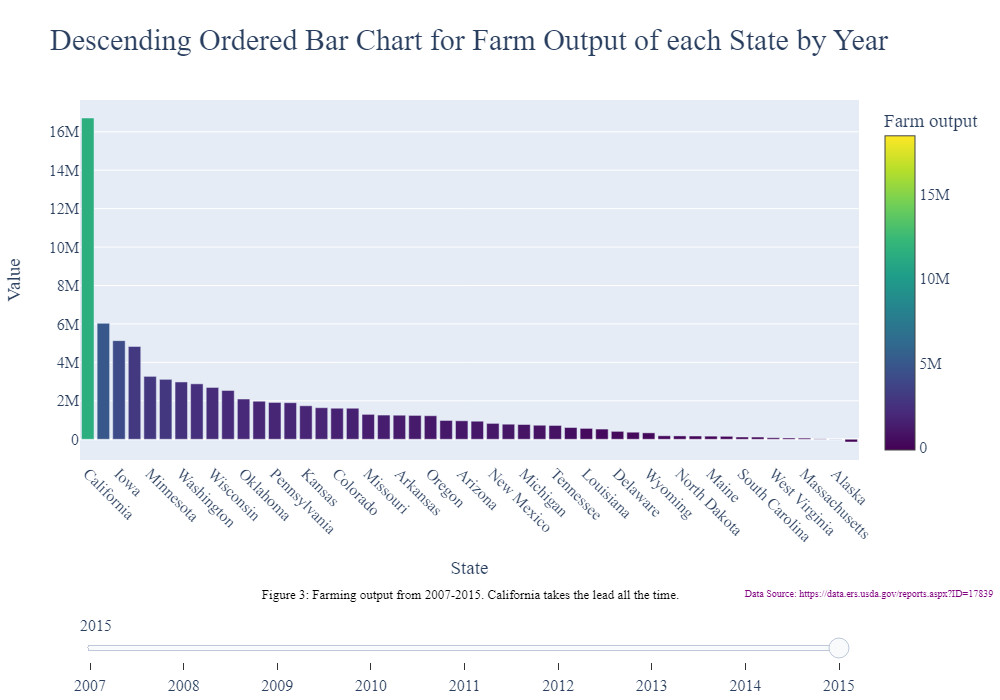
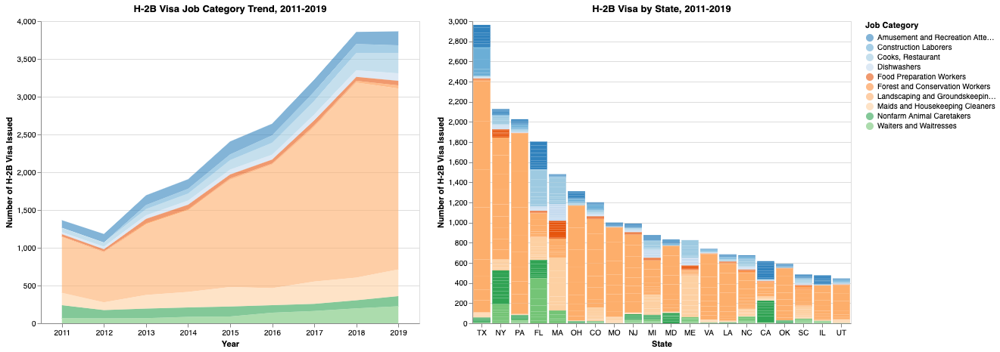
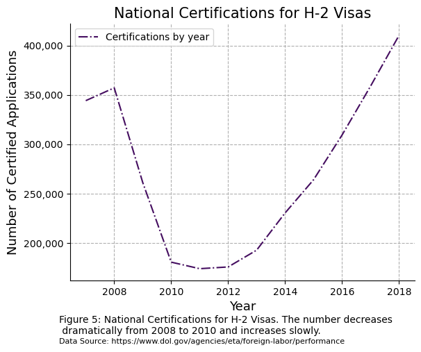
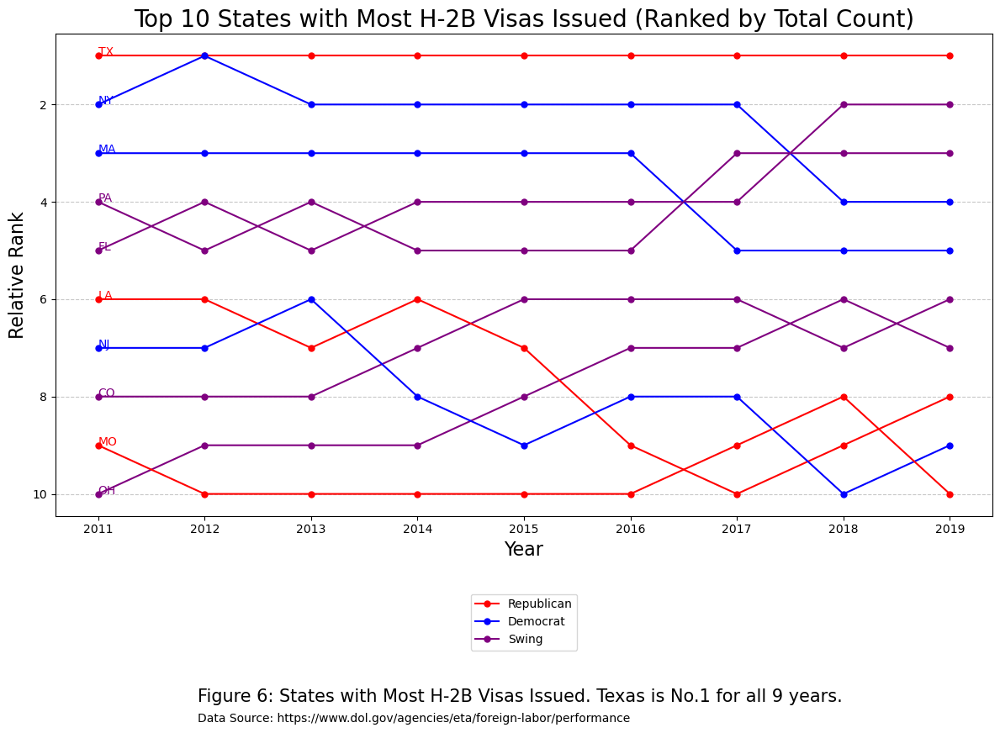

## Introduction

The impact of foreign workers holding working visas on the local economy is a subject of great interest and controversy. With the global economy relying on international trade, an increasing number of companies are employing foreign workers to fill positions, resulting in an inflow of working visa holders into numerous countries. While some proponents argue that these workers bring valuable skills and make significant contributions to the economy, others contend that they displace local workers and strain public services. This raises essential questions about the effects of working visa holders on the local economy and the wider social and political ramifications of international labor migration.

To uncover the reality, we have collected pertinent data and employed visualization techniques to analyze trends over several years.


## Data Gathering & Data Cleaning

To address our research question, we require data on working visa numbers and relevant economic indicators for each state and year and take into account the different policies and requirements for working visas across states. The primary working visas under consideration are the H-1B, H-2A, and H-2B programs. However, due to the H-1B visa's lack of transparency, we will primarily focus on the H-2A (seasonal agricultural work-related visa) and the H-2B (temporary non-agricultural visa).

To assess the impact of visa numbers on the local economy, we examine economic indicators closely related to the visa's purpose. For instance, we gathered agricultural income data for each state and associated it with the number of approved H-2A visas for that state in a given year. Additionally, we examined the H-2B visa's job areas to identify connections with the state's local specialties. For instance, if there is a Disneyland Park in Florida, tourism-related seasonal jobs would increase, leading to an increase in H-2B visas for that type of work.

It is noteworthy that the data we collected required extensive cleaning, including selecting the appropriate indicators and extracting useful information. Despite these challenges, we managed to extract valuable information and generate meaningful graphs from the data.

An example of our dataset:

```{python}
import pandas as pd
data = pd.read_csv('h2b.csv')
print(data.head(10))
```


## Overview of H-2 Programs

In this section, we examined H-2 visa certifications by state between 2011 and 2018. We extracted columns relevant to our research from the acquired CSV files for each year, renamed them, and combined them to create a new data frame. 


#### Number of H-2A & H-2B Certified Visas by State, 2011-2018

We used Plotly to create a choropleth map for each year with certification numbers represented by color. 

North Carolina consistently had high numbers of certified H-2A visa applications. California, Washington, Georgia, and Florida showed an increasing trend in applications over the eight-year period. The map also revealed a general increase in H-2A visa applications across the US, with colors becoming darker from 2011 to 2018. 

In comparison to H-2A visas, Texas had the most certified H-2B visas over the years, with a similar upward trend in applications. Our analysis provides a comprehensive overview of H-2 visa certifications by state and identifies the states with the highest application numbers.





[Link to Number of H-2A & H-2B Certified Visas by State, 2011-2018 ](./interactive/h2applicant.html)


## H-2A


#### Duration of H2A Certifications vs. Number of Certified Visas by Year

We utilized the duration of certification and created histograms representing the distribution of H-2A visa certifications by duration for each year by subtracting the start time from the end time.

The histograms showed that, in the earlier years, certifications with longer durations were certified more commonly. However, as time went on, more certifications were granted overall, indicating a possible shift in priorities or needs. This trend aligns with our findings from analyzing overall certified applications by state and year.



#### Farm Output by Top 10 States, 2015

In this study, we aimed to identify the top 10 states with the highest farming output from 2007 to 2015. To achieve this goal, we analyzed the total farming output of each state for the given period. We sorted the values of farming output in descending order for each year and selected the top 10 states with the highest farming output. Next, we generated a clear and easy-to-read bar plot to visualize the top 10 states for each year. The x-axis of the bar plot represents the state abbreviations, while the y-axis shows the corresponding farming output values. Our analysis provides a useful and informative summary of the top farming states during the given period.



From the bar plot, it is evident that certain states consistently make it to the top 10 list of highest farming output every year. Notably, per previous results, some of these states are also among the top H-2A visa-issuing states, including Georgia, California, Washington, and Florida.

[Link to H2A EDA plot](./interactive/farming_output.html)


## H-2B


#### H-2B Job Categories Analysis by state, 2011-2019 (Innovative)

To gain insight into the most popular job types and their demand in each state, we conducted an analysis of H-2B visa data from 2011-2019. We extracted relevant columns including job code, job name, employer state, and application status, keeping only successful applications. 

The resulting area plot illustrates the overall growth of different job types during the period, showing that all types grew at a similar pace. Among the job types, landscape & groundskeepers were the most popular, followed by housekeeping staff and restaurant workers.

In addition to the area plot, we created a stacked bar chart to visualize the demand for different jobs in each state. For example, Florida, California, and Texas had the most amusement park workers, which is not surprising given the presence of Disney parks in those states. States such as Texas, Pennsylvania, New York, Ohio, and Colorado had a high demand for landscaping workers, suggesting a focus on urban planning and design. New York, Florida, and California had the most non-farm animal caretaker jobs, indicating a higher demand for animal shelters and related services. Massachusetts, New York, and Florida had a higher demand for restaurant-related jobs, highlighting their strong dining industry. The analysis offers valuable insights into job demand trends across different states for H-2B visa holders.


[Figure 4: Left: H-2B program job category statstics by year. Right: H-2B program job category statistics by state. Both plots include tooltips on job category, state, and year. Data source: https://www.dol.gov/agencies/eta/foreign-labor/performance]{.aside}

[Link to H2B EDA plot](./interactive/H2B_EDA.html)


#### Geopolitical Analysis

Based on previous cleaned data, we can learn that from a national level, the certifications for H-2 Visas had a severe decline from 2008, potentially due to the global economic crisis. Ever since 2011, the number of certifications has been steadily increasing.




After examining the national-level side, we want to do some innovative analysis by adding geopolitical elements to our data frame. Therefore, we have observed a significant trend in the rankings of swing states on the top 10 lists since 2011. Out of the top 10 states with the highest number of H-2B workers, four of them are swing states. This trend suggests that the number of H-2B workers in swing states has been steadily increasing over the years.

There are two possible explanations for this increase. One potential explanation is that the economic conditions in these states may be more competitive, leading to a shortage of local workers to fill seasonal jobs. As a result, employers in these states may rely more heavily on the H-2B visa program to fill these positions during peak seasons. Another possible explanation is that there may be political pressure from key stakeholders, such as business groups and lobbyists, in these swing states. These groups may advocate for policies that support the H-2B visa program to ensure that businesses in their state have access to the workers they need.




## Conclusion

The Department of Labor has recorded a notable increase in the number of H2 visas certified over the years, with certain states consistently receiving high numbers of H2-A and H2-B certifications. However, recent data shows a shift towards approving more cases with shorter durations. It's worth noting that the impact of foreign workers on the local economy may not be as significant due to these shorter certification periods.

While landscaping and groundskeeping workers remain in high demand across most states, different policies from various parties can affect the number of working visa holders and their impact on the local workforce. It's important to highlight that there is currently no evidence of H-2 visa holders replacing local workers.

This study focuses solely on H-2 visas and does not examine the impact of foreign workers on local jobs directly. Future research could consider studying local jobs more directly or including H-1 visas to gain a more comprehensive understanding of the local economy.


## Reference

* “Performance Data.” DOL, https://www.dol.gov/agencies/eta/foreign-labor/performance.
* “Farm Sector Financial Indicators, State Rankings.” USDA ERS - Data Products, https://data.ers.usda.gov/reports.aspx?ID=17839


